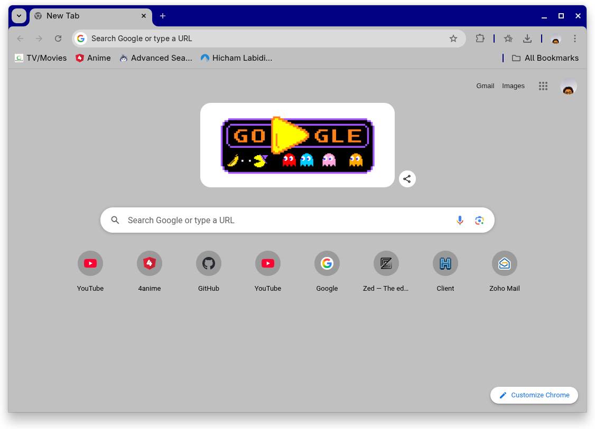

### First, a screenshot:

### Second, how to install:

- Head to [the releases](https://github.com/ghoomfrog/windows-classic-chrome/releases).
- Download windows-classic.zip: 
- Go to the Extensions page in Chrome (chrome://extensions).
- Enable Developer Mode: 
- Drag and drop windows-classic.zip onto the Extensions page.
- Voila! The theme will have been applied.